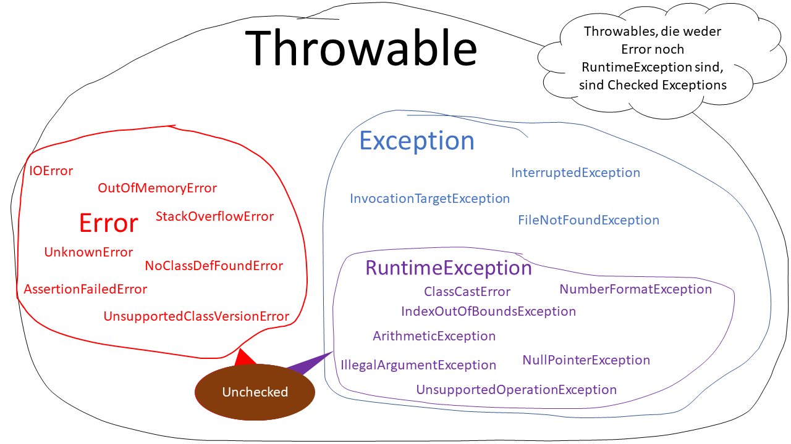

## Exception Zoo

> Definition: An exception is an event, which occurs during the execution of a program, that disrupts the normal flow of
> the program's instructions.

Quelle: https://docs.oracle.com/javase/tutorial/essential/exceptions/definition.html

> Definition: Eine Ausnahme (auch Ausnahmezustand) ist ein Ereignis, das während der Ausführung eines Programms
> auftritt und den normalen Ablauf der Programmschritte abbricht.

## Mengenleere

Am besten in die Java-Doc und Type-Hierarchie sehen.
