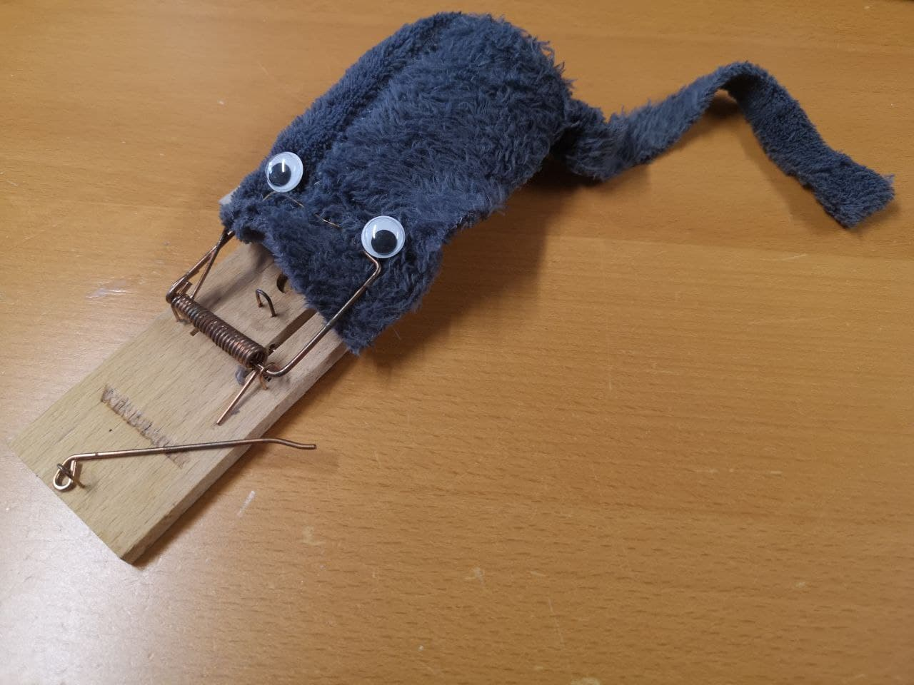
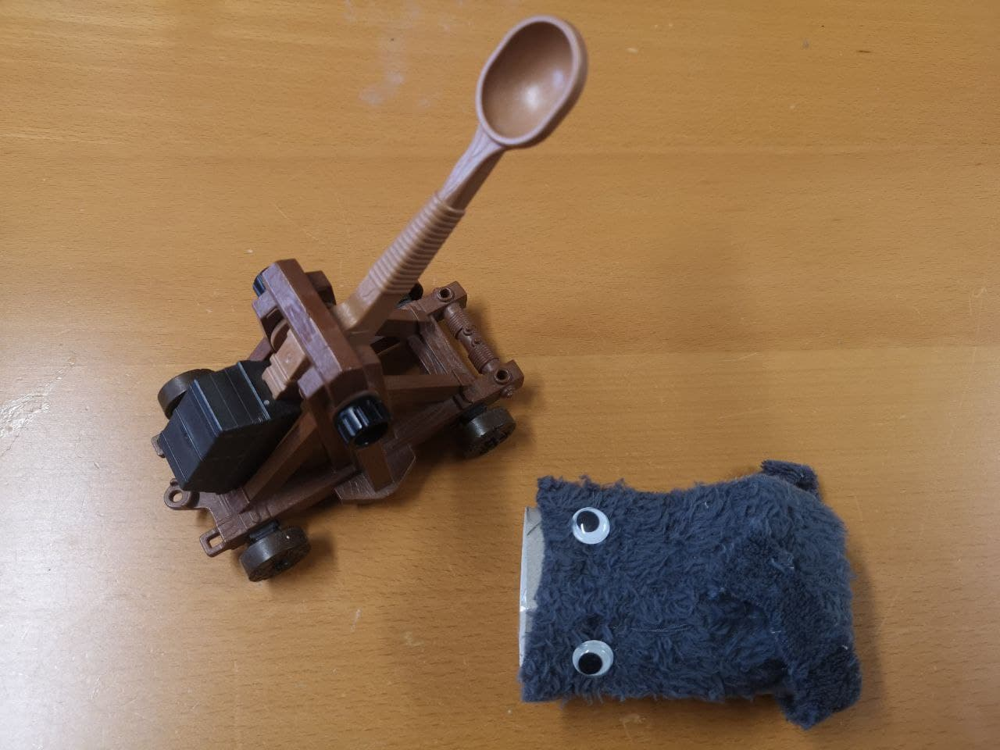
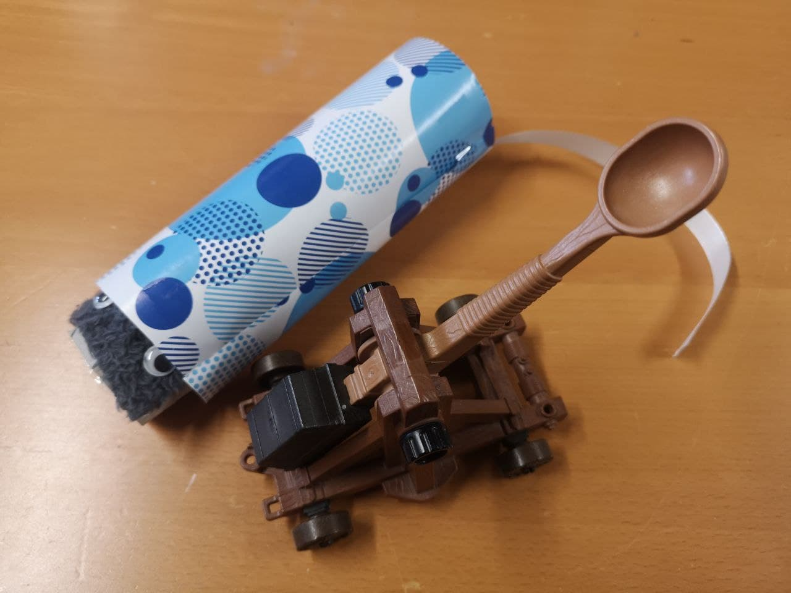

# Mäuse

Wenn Du einen Kompilierfehler wegen einer CheckedException hast, dann hast Du diese drei Optionen:

## Exception fangen

Definiert einen "Plan B" in Deinem Code.

```
void run() {
    try {
        Files.readString(...);
    } catch (IOException e) {
        // Dein Plan B
    }
}
```



## Weiterwerfen

Dann muss sich der aufrufende Code um das Problem kümmern.

```
void run() throws IOException { // <= "throws"
    Files.readString(...);
}
```



## Einpacken und weiterwerfen

Dann kümmert sich entweder der aufrufende Code darum, oder das Programm bricht ab.

```
void run() {
    try {
        Files.readString(...);
    } catch (IOException e) {
        throw new RuntimeException("Erläuterung der Auswirkung des Problems in diesem konkreten Fall", e);
    }
}
```


